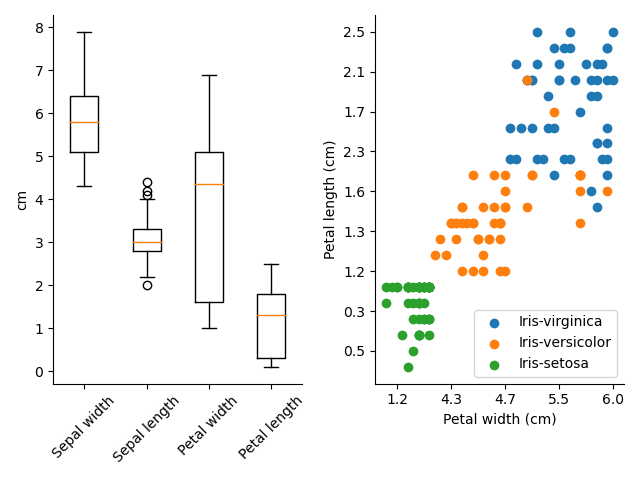

# Random matrix and plotting libraries

> Script to generate random matrix and save to .csv, and script to plot iris.data file

`use_data_processor.py` takes user arguments for file name to save matrix in, number of rows N, and number of columns M. An N x M matrix is then generated and filled with random values in (0, 1]. The file is saved in .csv format. `use_plotter.py` takes user arguments for the name of the iris data file. Three figures are then generated and saved to the user's directory: one with box plots of the lengths of the sepals and petals of the irises; one with scatter plots of petal width on the x axis and petal length on the y axis for each species; and one multi-panel plot with both of the previous plots on it.

Unit and functional tests ensure function inputs of the correct type are passed into the functions. They also ensure the correct numbers are being written into the .csv for `write_matrix_to_file`.



## Installation: 

N/A

## Usage Example

```
python use_data_processor.py --data_file_name 'something.csv' --num_rows INT --num_cols INT
```
```
python use_plotter.py --data_file_name 'iris.data'
```
## Development Setup

Dependencies: argparse, matplotlib, numpy, random, re, csv, pdb

## Release History
* 1.0 
    * Final submission
* 0.5
    * README and clean up
* 0.4 
    * Write functional tests
* 0.3
    * More tests for data_processor
    * Framework for plotter with unit tests
* 0.2
    * Framework filling matrix
    * Write unit tests alongside code
* 0.1
    * Add workflow file
    * Add environment file